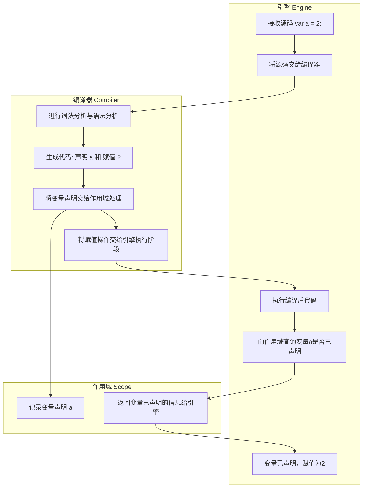

# 作用域是什么？

作用域是一套**规则**，用于确定变量存在何处以及如何查找变量（标识符）。如果查找的目的是为了赋值，那么就会使用 LHS 查询；如果目的是为了取值，就会使用 RHS 查询。

```mermaid
  flowchart TD
  %% 定义节点
  subgraph Engine[引擎 Engine]
    E1[接收源码 var a = 2;]
    E2[将源码交给编译器]
    E3[执行编译后代码]
    E4[向作用域查询变量a是否已声明]
    E5[变量已声明，赋值为2]
  end

  subgraph Compiler[编译器 Compiler]
    C1[进行词法分析与语法分析]
    C2[生成代码: 声明 a 和 赋值 2]
    C3[将变量声明交给作用域处理]
    C4[将赋值操作交给引擎执行阶段]
  end

  subgraph Scope[作用域 Scope]
    S1[记录变量声明 a]
    S2[返回变量已声明的信息给引擎]
  end

  %% 流程关系
  E1 --> E2
  E2 --> C1 --> C2
  C2 --> C3 --> S1
  C3 --> C4
  C4 --> E3
  E3 --> E4 --> S2
  S2 --> E5
```